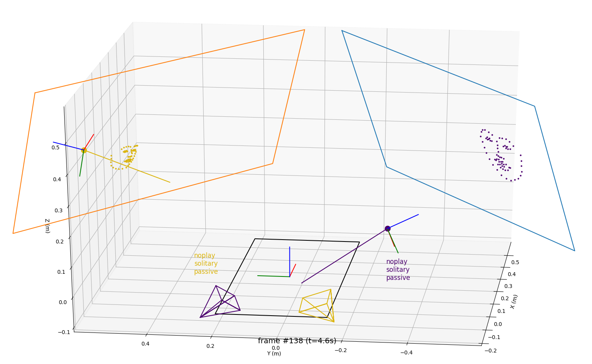

The Plymouth Interactive Social Robots dataset
==============================================

**Important**: *this repository **does not** contain the actual PInSoRo data
(~2TB would not work with GitHub!), only the meta data. See the [PInSoRo web
site](https://freeplay-sandbox.github.io/) for details to access the actual
data.*

This dataset contains 75 recordings of free-play interactions between 2 children
(45 recordings) or one child and one robot (30 recordings).

To learn more about the dataset, visit its [web
site](https://freeplay-sandbox.github.io/).

**You are very welcome to use this dataset for your own research. If you do so,
please cite the [The PInSoRo dataset: Supporting the data-driven study of
child-child and child-robot social
dynamics](https://doi.org/10.1371/journal.pone.0205999) article.**

Getting started
---------------

1. Download and unzip the [lastest version of the dataset from the Zenodo platform](https://doi.org/10.5281/zenodo.1043507)
2. Launch `python ./tools/visualise_dataset.py ./data/<record>/pinsoro-*.csv`.
   If everything is working as expect, this should replay the interaction as
   seen in the screenshot above.
3. Have fun! (and do not hesitate to use the source of `visualise_dataset.py` as
   a starting point for your own research)

More in depth, this repository contains two things:

- the dataset **metadata** (and **data** once you have obtained the actual data)
  in the `data/` subdirectory. [Check the README.md](data/README.md) file there
  to know more about how the data is stored.
- a few tools to explore and manipulate the dataset.
  [Check the README.md](tools/README.md) to know more.

Advanced analysis tools are available as well in [a separate
repository](https://github.com/freeplay-sandbox/analysis). Check [the dataset's
website](https://freeplay-sandbox.github.io/analysing) to know more about those.

Contact
-------

If you have specific questions about the dataset, you can contact
[Séverin
Lemaignan](mailto:severin.lemaignan@brl.ac.uk?subject="[PInSoRo]"). If your
question might be relevant to other people, please instead [open an
issue](https://github.com/freeplay-sandbox/dataset/issues).

