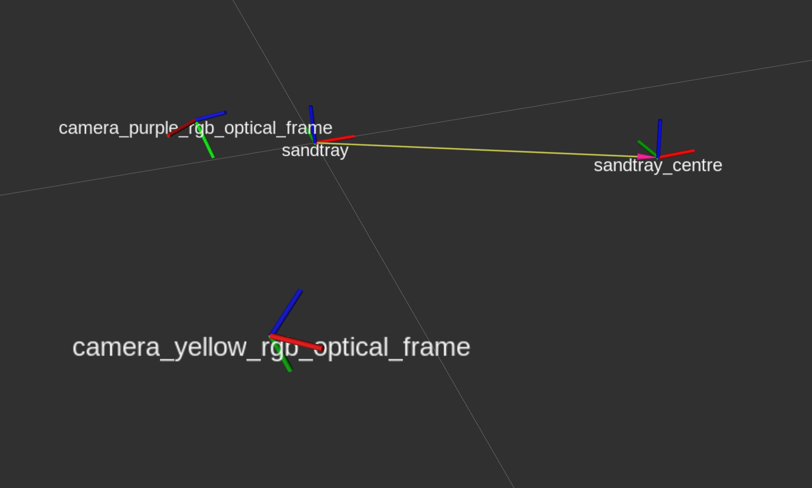

PInSoRo dataset - data structure
================================

Each sub-directory represents one interaction. Directories are named after the
date and time at which the interaction has been recorded.

The content of the directories depends on the data you have actually downloaded:

- this repository contains only the dataset's *meta-data* and *annotations* (cf
  section *Meta-data* below)
- if you have downloaded the publicly available *anonymous dataset* from
  [Zenodo](https://doi.org/10.5281/zenodo.1043507), you find additional CSV
  files containing facial features, skeletons, gaze, etc. See section *Anonymous
  dataset* below.
- if you have [obtained access](https://freeplay-sandbox.github.io/application) to the full data, the subdirectories also
  contains the original ROS bag files, including all the raw audio and video
  footage.

## Meta-data

- `experiment.yaml`: contains the interaction details.

Example:

```yaml
timestamp: 1496917355889909029 # timestamp of the begining of the interaction
condition: childchild # condition (childchild or childrobot)
purple-participant:
  id: 2017-06-08-11:18-p1
  age: 4
  gender: female
  details:
    tablet-familiarity: 0  # self-reported familiarity with tablets, from 0 (no familiarity to 2 (familiar)
yellow-participant: # absent in the child-robot condition
  id: 2017-06-08-11:18-y1
  age: 4
  gender: female
  details:
    tablet-familiarity: 2
markers:  # events of interest, annotated during the experiment by the experimenter. Timestamps in seconds from the begining
  75.936775922: interesting
  104.153236866: interesting
  214.65380907: interesting
  328.371172904: interesting
  376.429432868: interesting
  428.393737077: interesting
  590.867943048: issue
  685.981807947: interesting
  708.350763082: issue
  789.571500062: interesting
  811.970171928: interesting
notes: # open-ended notes, taken by the experimenter during the experiment. Timestamp in seconds from the begining.
  general: Both very quiet. P has done experiment before (1y002).
  75: Very quiet
  104: Y watching P
  214: Both absorbed in own games
  328: Confusion about colours
  376: P drawing pictures
  428: Quiet battle about colours
  590: P to FS "Look!"
  685: Y copied P's drawing
  708: P seeking encouragement from FS
  780: P drawing pictures, Y scribbling
  811: Both seem kind of bored
postprocess: # (optinal) details of specific post-processing performed on that
recording
    - recompressed sandtray background, start timestamp moved from 1496917354.451842 to 1498168785.467365
issues: # (optional) specific issues with this dataset
    - skeleton extraction failed
```

- `freeplay.bag.yaml`: this file describes the content of `freeplay.bag`. It can
  also be used to check the exact duration of the recording.
- `freeplay.annotations.<annotator name>.yaml`: annotations of social behaviours
  for this recording (*missing for a few interactions that have not been
  annotated*). The timestamps in these files correspond to the ROS bag file
  timestamps.
- `freeplay.bag.md5`, `freeplay.poses.json.md5`, `visual_tracking.bag.md5`,
  `visual_tracking.poses.json.md5`: the MD5 checksums of the corresponding
  files, used to verify the data integrity of the recordings.

## Anonymised dataset

- `pinsoro-*.csv`: an easy-to-consume CVS file with all the main dataset
  features, sampled at 30Hz. [See below for the
  details](#format-of-the-csv-files). **THIS IS MOST LIKELY THE FILES YOU WANT
  TO USE**.
- `freeplay.poses.json`: stores the skeletons and facial features extracted from
  each of the video frames. See here [the format of the poses
  data](https://github.com/freeplay-sandbox/analysis#format-of-poses-files).
- `visual_tracking.poses.json`: same as `freeplay.poses.json`, but for the
  visual tracking preliminary task (a short task that the children performed
  before starting to play. They were instructed to follow with their gaze a
  moving target on the touchscreen)

## Full dataset

- `freeplay.bag`: the raw recordings, as [ROS bag
  file](http://wiki.ros.org/Bags). These bag files contains in particular all
  the RGB-D video streams and audio streams. To replay them, you need the
  `rosbag` tool to be installed, or other dedicated tools. See the
  [`tools/README.md`](../tools/README.md) for more details.
- `visual_tracking.bag`: same as `freeplay.bag`, but for the visual tracking
  preliminary task (a short task that the children performed before starting to
  play. They were instructed to follow with their gaze a moving target on the
  touchscreen)
- `video/camera_{purple|yellow|env}_raw.mkv`: RGB video streams extracted from the bag, for all three cameras (the two child-facing cameras and the environment camera)
- `video/camera_{purple|yellow|env}_skel.mkv`: skeleton and facial features of
  the children, over a uniform black background
- `video/camera_{purple|yellow|env}.mkv`: skeleton and facial features of
  the children, overlaid on the raw video footage
- `audio/freeplay_camera_{purple|yellow}_audio.{mp3|wav}`: audio streams, as recorded by the two child-facing cameras


Format of the CSV files
-----------------------

### General considerations

The `pinsoro-*.csv` files contains 449 fields, explained below.
The first row contains the columns headers.

The data is sampled at 30Hz. It starts at the first video frame of either of the
2 cameras filming the children's faces. Details of the cameras configuration and
calibration are available below.

Note that the children were wearing brightly colored sport bibs (the left child
had a yellow one, the right child a purple one). The (left) camera filming the
(right) *purple child* is accordingly refered to as the *purple camera*, and the
(right) camera filming the *yellow child* as the *yellow camera*.

Besides, in the child-robot condition, the robot was always replacing the
*yellow child*. Hence, in that condition, all yellow child-related data is
missing.

### CSV fields

- `timestamp`: UNIX timestamp of the row; the first timestamp is the timestamp
  of the first recorded video frame, on either of the two cameras
- `id`: ID of this recording (simply the date and time of the start of the
  experiment -- note that this is typically a few minutes before the the
  timestamp of the first video frame)
- `condition`: child-child or child-robot. [Refer to the
  website](https://freeplay-sandbox.github.io/dataset) for details.
- `annotators`: name of the annotators who annotated this interaction. If empty,
  this interaction has not been annotated. If more than one annotator, the names
  are separated by a '+'
- `complete`: true if all the data is available at that timestamp. Might be
  false for different reasons (no annotation, missing video frame, etc)
- `purple_child_age`, `purple_child_gender`, `yellow_child_age`, `yellow_child_gender`: self explanatory
- `purple_frame_idx`: index of the frame in the purple camera video stream.
  Can be used to quickly extract a specific frame or range of frame in the video
  stream
- `purple_child_face{00..69}_{x,y}`: 2D coordinates of the 70 facial landmarks
  (including pupils), normalised in [0.0, 1.0], extracted by
  [OpenPose](https://github.com/CMU-Perceptual-Computing-Lab/openpose/). See
  [OpenPose
  documentation](https://github.com/CMU-Perceptual-Computing-Lab/openpose/blob/master/doc/output.md#face-output-format)
  for the location of these landmarks.
- `purple_child_skel{00..17}_{x,y}`: 2D coordinates of the 18 skeleton
  keypoints, normalised in [0.0,1.0], extracted by
  [OpenPose](https://github.com/CMU-Perceptual-Computing-Lab/openpose/). See
  [OpenPose
  documentation](https://github.com/CMU-Perceptual-Computing-Lab/openpose/blob/master/doc/output.md#pose-output-format-coco)
  for the location of these keypoints. Note that, due to the experimental
  setting generating a lot of occlusion (children sitting in front of a table),
  the skeletal data is not always reliable
- `purple_child_head_{x,y,z,rx,ry,rz`: head pose estimation, in m and rad, relative to the table centre (see below for the camera extrinsics). Computed using [OpenFace](https://github.com/TadasBaltrusaitis/OpenFace).
- `purple_child_gaze_{x,y,z}`: gaze vector, averaged for both eyes, relative to the table centre. Computed using [OpenFace](https://github.com/TadasBaltrusaitis/OpenFace).
- `purple_child_au{01,02,04,05,06,07,09,10,12,14,15,17,20,23,25,26,28,45}`:
  Intensity of 18
  facial action units, extract using [OpenFace](https://github.com/TadasBaltrusaitis/OpenFace). See [here](https://github.com/TadasBaltrusaitis/OpenFace/wiki/Action-Units) for the details.
- `purple_child_motion_intensity_{avg,stdev,max}`: average, standard deviation
  and maximum of the magnitude of the motion observed in the frame. This is
  computed by performing a [optical flow computation using the Dual TVL1 algorithm](https://github.com/freeplay-sandbox/analysis/blob/master/src/optical_flow.cpp#L163) and averaging the resulting values on the whole frame
- `purple_child_motion_direction_{avg,stdev}`: average and standard deviation
  of the direction of the motion observed in the frame. This is
  computed by performing a [optical flow computation using the Dual TVL1 algorithm](https://github.com/freeplay-sandbox/analysis/blob/master/src/optical_flow.cpp#L163) and averaging the resulting values on the whole frame
- [same keys for the yellow camera] **Note that these values are missing in the
  child-robot condition**
- `audio_{00..15}`: 15 audio features, extracted using [OpenSmile](https://github.com/georgepar/opensmile/). **These values are currently missing**.
- `{purple,yellow}_child_{task_engagement,social_engagement,social_attitude}`: manual annotations of the social interaction. See the [coding scheme.](https://freeplay-sandbox.github.io/coding-scheme). If more that one annotator annotated this frame, **and the annotators disagreed**, the different annotations are separated by a `+`

### Cameras extrinsic calibration

#### Pose of cameras

The following diagram gives an overview of the orientation and positioning of
the 2 child-facing cameras with respect to the interactive table centre:



The exact positions of the cameras is as follow:

```python
YELLOW_CAM_TO_CENTRE_QUATERNION=[-0.530, 0.220, -0.314, 0.757]
YELLOW_CAM_TO_CENTRE_TRANSLATION=[-0.408, -0.208, 0.035] # m

PURPLE_CAM_TO_CENTRE_QUATERNION=[0.220, -0.530, 0.757, -0.314]
PURPLE_CAM_TO_CENTRE_TRANSLATION=[-0.408, 0.190, 0.035] # m

# [these values were obtained with the following steps:]
# $ rosparam set /use_sim_time True
# $ rosbag play --clock freeplay.bag
# $ rosrun tf static_transform_publisher -0.3 0.169 0 0 0 0 sandtray_centre sandtray 20
# $ rosrun tf tf_echo sandtray_centre camera_{purple|yellow}_rgb_optical_frame
```

They can be used to transform a point (or a vector) from the camera frames to
the table frame (`sandtray_centre`):

```python
import numpy
import transformations # transformations library by Christoph Gohlke

def make_transform_matrix(quaternion, translation):
    M = numpy.identity(4)
    T = transformations.translation_matrix(translation)
    M = numpy.dot(M, T)
    R = transformations.quaternion_matrix(quaternion)
    M = numpy.dot(M, R)

    M /= M[3, 3]

    return M

YELLOW_CAM_TO_CENTRE =  make_transform_matrix(YELLOW_CAM_TO_CENTRE_QUATERNION, YELLOW_CAM_TO_CENTRE_TRANSLATION)
PURPLE_CAM_TO_CENTRE =  make_transform_matrix(PURPLE_CAM_TO_CENTRE_QUATERNION, PURPLE_CAM_TO_CENTRE_TRANSLATION)

# Then:
# numpy.dot({PURPLE,YELLOW}_CAM_TO_CENTRE, <vector>) transforms
# a vector <vector> from one of the camera's frame to the centre of the sandtray table frame.
```

# Focal lens, resolution

The focal lens, optical centre and camera resolution are as follow:

- `fx`: 697.811 
- `fy`: 697.811 
- Optical centre `cx`: 479.047
- Optical centre `cy`: 261.227
- `rx`: 960 pixels
- `ry`: 540 pixels
